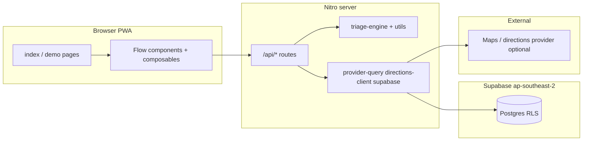
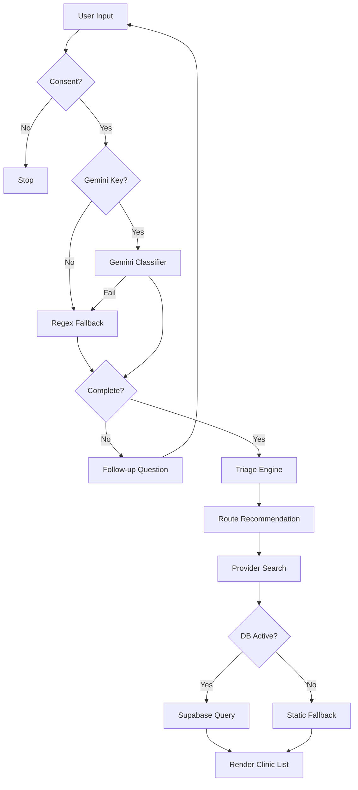

<h1 align="center">GoWhere WA</h1>

<p align="center">
  <strong>Panic-proof care routing for Western Australia</strong>
</p>

<p align="center">
  <a href="https://github.com/zinken7/visagio-hackathon/actions/workflows/ci.yml"></a>
  &nbsp;
  <a href="LICENSE"></a>
  &nbsp;
  <a href="https://nuxt.com"></a>
  &nbsp;
  <a href="https://supabase.com"></a>
  &nbsp;
  <a href="https://vitest.dev"></a>
</p>

<p align="center">
  <sub>GoWhere WA helps users select the correct health care setting (GP, Urgent Care, Pharmacy, or ED) without diagnosing them.</sub>
</p>

<p align="center">
  <sub><a href="#core-principles">Principles</a> · <a href="#features">Features</a> · <a href="#architecture">Architecture</a> · <a href="#data-pipeline">Data Pipeline</a> · <a href="#getting-started">Getting Started</a> · <a href="#environment-variables">Environment</a> · <a href="#testing">Testing</a></sub>
</p>

***

## Core Principles

- **No Diagnosis:** Directs users to appropriate services, not to specific medical conditions.
- **Deterministic Logic:** Given the same symptoms and context, the recommendation remains identical.
- **Privacy First:** Explicit consent gates symptom entry. No long-term storage of locations or health data.
- **Graceful Fallbacks:** Works offline or when external services (Supabase, Gemini) are down.

---

## Features

- **Voice/Text Intake:** Users can type or dictate free-form symptoms.
- **Intelligent Classification:** Converts inputs into structured triage signals via Gemini API, with a local regex backup.
- **Guided Follow-up:** Asks multi-choice questions if symptom inputs are vague or incomplete.
- **Clinic Locator:** Sorts nearby clinics using the Haversine formula (distance) or suburb filter.
- **PWA Ready:** Fully installable mobile and desktop experience.

---

## Architecture

GoWhere WA is a full-stack Nuxt 4 application deployed on Vercel, utilizing Supabase for provider data persistence.



- **Client App (Nuxt 4 / Vue 3):** Renders interactive forms, maps, and recommendations. Exposes no secrets.
- **Nitro Server Routes:** Runs classification logic, database queries, and third-party integrations securely.
- **Database (Supabase):** Stores geographical coords and information for Western Australia clinics.
- **Triage Engine:** A pure TypeScript module applying deterministic logic tables to symptom signals.

---

## Data Pipeline

The diagram below shows how raw symptom text is transformed into local clinic recommendations:



### Pipeline Details

1. **Intake Processing (`/api/intake/analyze`):** Parses voice or text transcripts. First tries the Gemini API if `NUXT_GEMINI_API_KEY` is present. Otherwise, triggers a local keyword parser to identify clinical flags.
2. **Care Recommendation (`/api/triage/recommend`):** Evaluates `TriageSignals` against deterministic rule lists. Red flags (e.g. chest discomfort, severe breathing issues) route directly to ED.
3. **Provider Selection (`/api/providers/nearby`):** Resolves the target `CareRoute` relative to suburb filters or geolocation coordinates. Queries Supabase using a spatial formula, falling back to static WA clinics if database is unconfigured.

---

## Getting Started

### Prerequisites

- **Node.js** 22+
- **pnpm** 10+

### Installation

```bash
# Clone the repository
git clone https://github.com/zinken7/visagio-hackathon.git
cd CarePath

# Install dependencies
pnpm install

# Setup environment configuration
cp .env.example .env

# Run local development server
pnpm dev
```

The application will run locally at `http://localhost:3000`.

---

## Environment Variables

Configure these variables locally in `.env` and on your Vercel hosting settings.

| Name | Type | Scope | Description |
|------|------|-------|-------------|
| `NUXT_PUBLIC_SUPABASE_URL` | URL | Public | Your Supabase project URL. |
| `NUXT_SUPABASE_SERVICE_ROLE_KEY` | String | Server-Only | Database access key. Do not expose to frontend. |
| `NUXT_GEMINI_API_KEY` | String | Server-Only | (Optional) API key for symptom text classification. |
| `NUXT_GEMINI_MODEL` | String | Server-Only | (Optional) Model name. Defaults to `gemini-2.5-flash`. |
| `NUXT_INTAKE_DEBUG_LOGS` | Boolean | Server-Only | (Optional) Set `true` to log non-sensitive intake stages. |

---

## Testing

Ensure code quality commands run clean before pushing changes:

```bash
pnpm lint       # Run ESLint validation
pnpm typecheck  # Run TypeScript verification
pnpm test       # Run Vitest unit tests
pnpm build      # Run production build compilation
```

The unit test suite covers:
- **Triage Logic:** Unit tests in [triage-engine.spec.ts](file:///Users/tyrone/Downloads/CarePath/tests/unit/triage-engine.spec.ts) checking input-to-route rules.
- **Classifier mapping:** In [map-gemini-intake.spec.ts](file:///Users/tyrone/Downloads/CarePath/tests/unit/map-gemini-intake.spec.ts) validating JSON payloads.
- **Spatial queries:** In [provider-query.spec.ts](file:///Users/tyrone/Downloads/CarePath/tests/unit/provider-query.spec.ts) confirming Haversine sorting.

---

## Supabase Setup (Optional)

1. Create a project in region **Sydney `ap-southeast-2`**.
2. Run database migrations:
   - `supabase/migrations/001_providers.sql`
   - `supabase/migrations/002_households.sql`
3. Load sample provider datasets:
   - `supabase/seed/providers.sql`

---

## Directory Structure

Key directories and files in this repository:

- `app/` - Frontend components, Vue assets, layouts, and pages.
- `server/` - Nitro server API endpoints and triage processing engines.
- `shared/` - Common Typescript schemas, interfaces, and variables.
- `supabase/` - Database SQL migrations and mock seed datasets.
- `tests/` - Vitest unit tests.
- `docs/` - Original design, SPEC, and architectural documentation.
