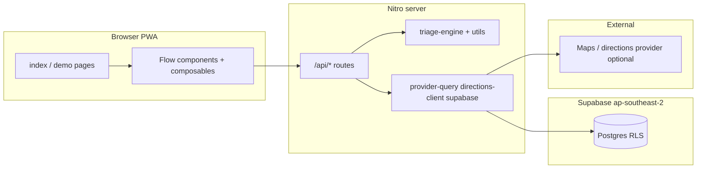

# GoWhere WA — Architecture (MVP)

**Scope:** Matches `docs/SPEC.md` — care routing only (no diagnosis), deterministic rules, one polished golden path, anonymous demo, English, web + PWA, Supabase + Vercel, Nuxt 4 full-stack.

**Planning mode:** Solo hackathon; optimize for **vertical slices** (user-visible capability per slice), not a frontend-then-backend split.

---

## 1. Architectural goals

| Goal | How |
|------|-----|
| Deterministic routing | Single **triage engine** (pure functions + versioned rule inputs/outputs) used by the recommend API and tests |
| Explainable output | Recommendation includes human-readable **reason codes** (not clinical labels as diagnosis) |
| Panic-proof UX | Linear flow, obvious back/exit, **SafetyNetBox** + disclaimer on health screens |
| Demo reliability | **Fallback paths** when Supabase, maps, or geolocation are unavailable (see `tasks/plan.md`) |

---

## 2. Runtime view

- **Client:** Nuxt pages and flow UI; **no secrets**; calls only public server routes.
- **Server:** All rule execution and provider/direction enrichment; Supabase with **service role only on server** where needed, never exposed to client.
- **Data:** MVP may use DB for seeded providers; anonymous demo can operate with **static fallback** if DB is skipped (per plan).

---

## 3. Vertical slices (conceptual)

Slices are **end-to-end** thin paths: UI + API + engine touch as needed, not “all APIs then all pages.”

| Order | Slice name | Delivers |
|-------|------------|----------|
| S0 | **Foundation** | Nuxt app, lint/build, health route, global layout shell, disclaimer placement pattern |
| S1 | **Core route** | Versioned triage engine + `POST /api/triage/recommend` + minimal UI proving same inputs → same route |
| S2 | **Golden path** | Full flow screens (`EntryActions` → … → `RecommendationCard` + `SafetyNetBox`) wired to one scripted journey |
| S3 | **Consent gate** | Explicit consent before symptom/health inputs; minimal storage; aligns with Boundaries |
| S4 | **Location + providers** | `LocationStep` + `GET /api/providers/nearby` + list UI (`ServiceList`); map as Should |
| S5 | **Map / directions** | Map components and/or `GET /api/directions/route` + external open; graceful degradation |

Dependencies: S1 blocks S2; S2 blocks polishing; S3 can overlap S2 but must complete before storing data; S4/S5 optional for minimal demo if fallback is used.

---

## 4. Intake parser (voice-first layer)

- **Location:** `server/lib/intake-parser.ts` (imported by `server/api/intake/analyze.post.ts` and unit tests).
- **Shared types:** `shared/intake-types.ts` — discriminated union response: `emergency | confirm | follow_up`.
- **Contract:** Input = free-form text (voice transcript or typed). Output = structured `TriageSignals` (when enough info) or follow-up questions (when missing).
- **Design:** Deterministic keyword/pattern matching — no LLM dependency. Emergency keywords trigger immediate escalation.
- **Relationship to triage engine:** The intake parser produces `TriageSignals`; the triage engine consumes them. They are completely decoupled — intake could be replaced with an LLM layer without touching the engine.

---

## 5. Triage engine (single source of truth)

- **Location:** `server/lib/triage-engine.ts` (imported by `server/api/triage/recommend.post.ts` and unit tests).
- **Shared types & route helpers:** `shared/triage-types.ts`, `shared/care-routes.ts` (canonical `CareRoute` list + `parseCareRouteQuery` for `/api/providers/nearby`).
- **Helpers:** `server/utils/*` (e.g. red-flags / safety-net) — optional; not all SPEC placeholders exist yet — keep **pure** where possible.
- **Contract:** Input = structured signals (flags, severity, timing, persona). Output = `CareRoute`-style enum + **reason codes** + copy keys for UI.
- **Versioning:** Engine exposes a **rule version** string in API responses for audit and tests.

---

## 5. State and persistence

- **Flow state:** Client-side (composables / Pinia per SPEC) for session; reset on refresh acceptable for MVP unless persistence is explicitly added.
- **Anonymous demo:** No accounts required; **households** table (see migrations in SPEC) is **Should** — only if time allows and RLS is correct.
- **Providers:** Seeded via `supabase/seed/` when DB is in use; else static JSON served or embedded in server layer for fallback demo.

---

## 6. Compliance hooks (non-negotiable from SPEC)

- Disclaimer on health-related screens; consent before collecting health/symptom data.
- No long-term raw location storage; minimize stored fields.
- RLS on any table holding user or health-related data; delete path when user-linked data exists.

---

## 7. Docs map

| Document | Purpose |
|----------|---------|
| `docs/SPEC.md` | Product scope, boundaries, success criteria |
| `docs/ARCHITECTURE.md` | This file — structure and slices |
| `docs/API.md` | HTTP contracts for Nitro routes |
| `README.md` | Local setup, **Vercel env names**, Supabase migrations, **A5 preview verification** checklist |
| `tasks/plan.md` | Hackathon plan, order, checkpoints, fallback demo |
| `tasks/todo.md` | Executable tasks with Must/Should/Could |

---

**Status:** Aligned with MVP `docs/SPEC.md`; update when scope or slices change.
